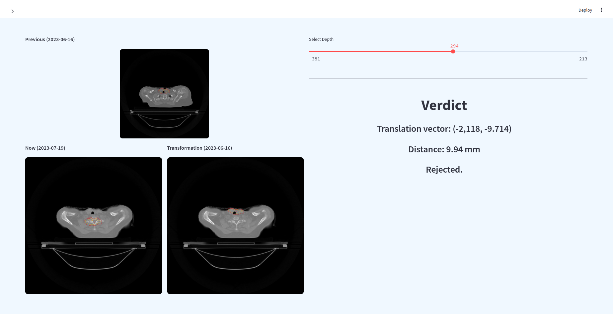

# 3D annotation translation

AI system to transform annotations of CT scans made by doctors, including critical areas like the spinal cord and esophagus, and regions of interest such as GTV and CTV, using an affine transform computed by an algorithm; the annotations (shaded red) are transferred to unannotated CT scans.

# Setup

## Install dependencies

    pip install -r requirements.txt

## Run demo

    make website

